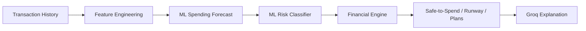

# ML architecture

## Why ML was added

The coach already has deterministic finance calculations. The optional ML layer adds a compact estimate of likely personal spending and short-term liquidity stress from transaction-history features. It does not move money, alter authentication, approve transfers, or replace the existing safety rules.



## Models and features

- Spending forecast: `RandomForestRegressor`, jointly predicting next-7-day and next-30-day spending.
- Risk classifier: `RandomForestClassifier`, producing `LOW`, `MEDIUM`, or `HIGH` risk plus probabilities.
- Both use defensive transaction-derived features: recent averages/totals and counts, amount statistics, balance, observed income, cash-out/send-money/category spending, recurring costs, weekday/weekend behavior, income timing, prior periods, trend, balance-to-spending ratio, and volatility. The classifier additionally uses the forecast, income/spending ratio, runway, reserve ratio, upcoming bills, and cash-out ratio.

Malformed or missing transaction fields are ignored or represented as conservative zero/default features; they cannot crash a request.

## Synthetic data and training

`app.ml.synthetic_data` creates a reproducible, seeded data set of 8,000 samples by default. Profiles include students, salaried and irregular-income workers, high spenders, disciplined savers, frequent cash-out users, high-bill users, weekend-heavy users, stable spenders, and volatile spenders. Spending targets follow income, observed spending pace, trend, recurring bills, and controlled noise. Risk labels follow projected liquidity, runway, spending-to-income ratio, and reserve coverage — not random classes.

Train manually from `backend/`:

```bash
python -m app.ml.train_models
```

The command saves a compact CSV under `app/ml/data/`, joblib artifacts under `app/ml/models/`, and holdout metrics in `app/ml/models/model_metrics.json`. It uses a stratified 80/20 split and `random_state=42`. Actual MAE, RMSE, R², accuracy, precision, recall, F1, confusion matrix, classification report, and multiclass OVR ROC-AUC are recorded from that run.

## Runtime and safety boundary

Models are loaded once at startup (or first use) and never retrained by an API request. `/api/v1/ml/forecast`, `/risk`, `/summary`, and `/metrics` expose the output and real saved metrics.

The existing deterministic financial engine remains authoritative. When a saved forecast is available, its predicted spending augments the forecast used by Money Runway. Safe-to-Spend still protects the balance with existing commitments, reserve, and savings allocation; it only subtracts the ML forecast's non-recurring portion so known bills are not double counted. Plans, transfer confirmation, PIN checks, and authentication remain unchanged.

Groq receives structured evidence only. Its system prompt explicitly forbids inventing balances, predictions, risk levels, or other financial values; it can only explain backend-calculated or ML-produced values.

## Fallback behavior

If scikit-learn is unavailable, an artifact is missing/corrupt, feature extraction fails, or inference errors, the model service returns no prediction. The API then returns a deterministic historical-spending forecast and a transparent rules-based risk level with `source: "deterministic_fallback"`. Dashboard, financial health, plans, assistant, transactions, and authentication continue to run normally.
