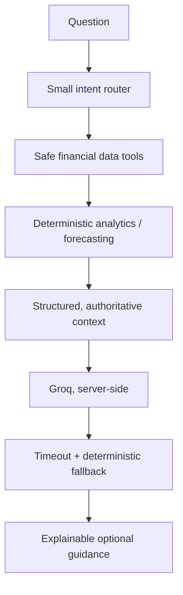

# Grounded AI design

The LLM has no database credentials, transaction query tool, or authority to move money. Totals, balance reasoning, feasibility, health score, budget values and forecasts are computed before generation. The prompt explicitly forbids inventing amounts, lending decisions, guarantees, manipulation and shaming. If Groq is unavailable or has no configured key, the endpoint returns a concise deterministic explanation from the same evidence.

Current intent routing recognizes spending/low-balance terms and otherwise provides budget, forecast and health context. This is deliberately narrow and inspectable for the hackathon; it can be expanded with test-backed intents rather than free-form LLM tool selection.
