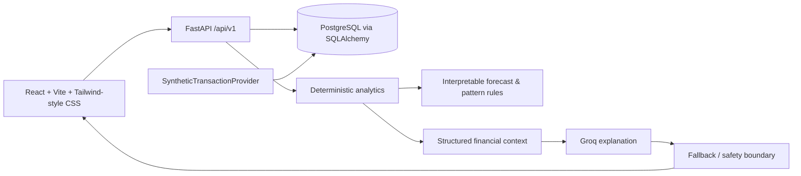

# Architecture

`SyntheticTransactionProvider` is presently implemented by the seed service. A future `UpayTransactionProvider` would sit behind the same data-ingestion boundary only after consent, governance, API access, anonymization, and security review. No production upay API is claimed.

The app defaults to SQLite only for easy local demo startup; `DATABASE_URL` supports PostgreSQL/psycopg and Docker Compose provides Postgres. Production uses PostgreSQL, migrations, restricted CORS, a non-default JWT secret, and TLS at the deployment edge.
